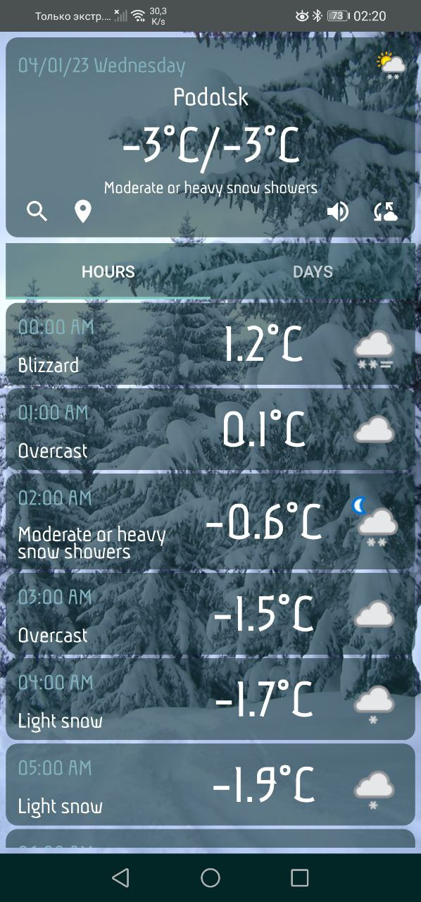
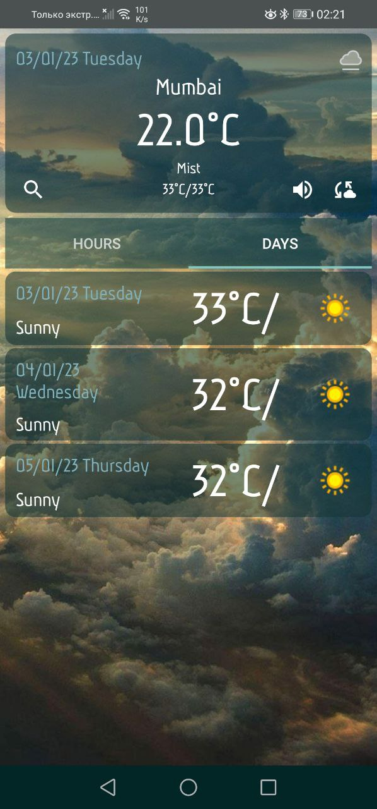
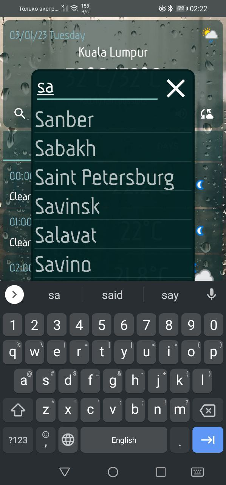
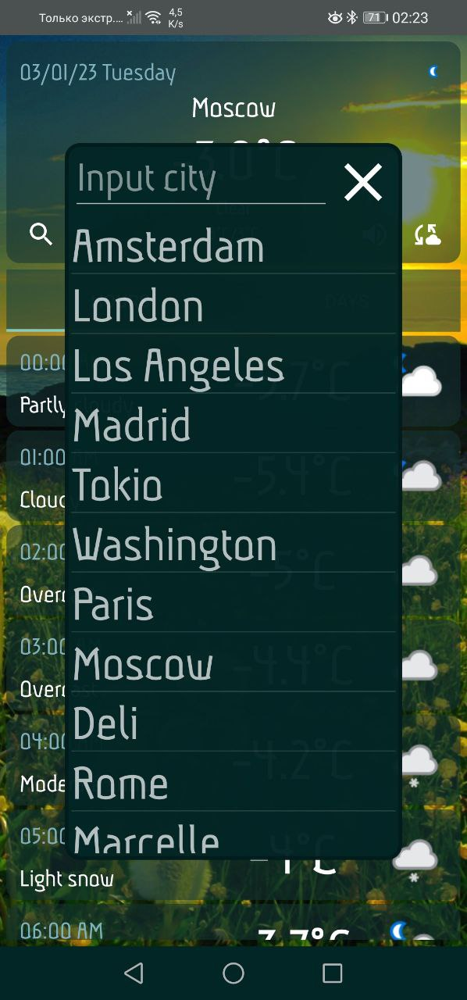

# WeatherApp
The weather app on Kotlin
Shows the weather forecast by geolocation at the moment, for several days ahead, as well as every hour of these days.
There is a search for weather forecasts in various cities.
The weather forecast, as well as the list of cities are taken via the API from free servers
The weather change is accompanied by a sound effect and animation

    
    
    
    

